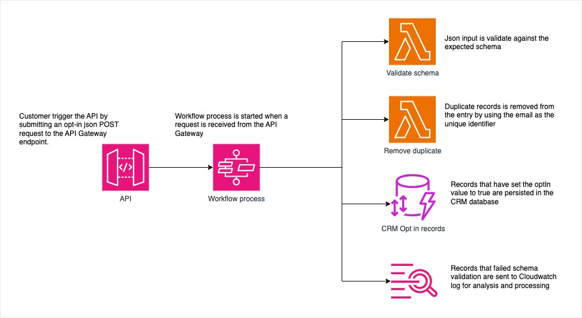
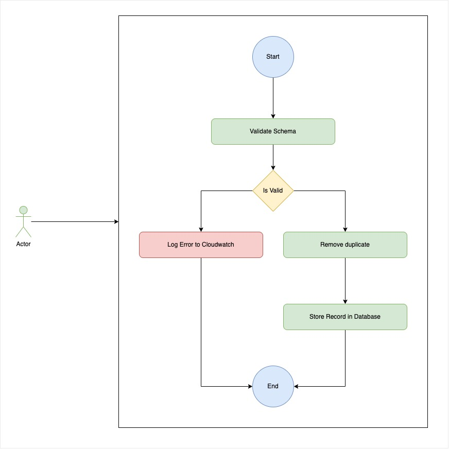
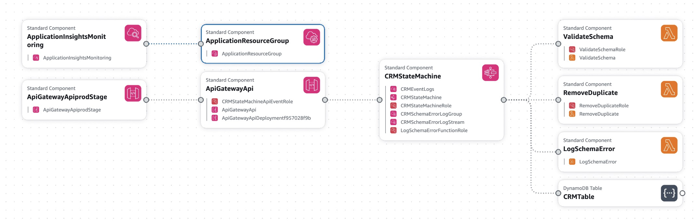
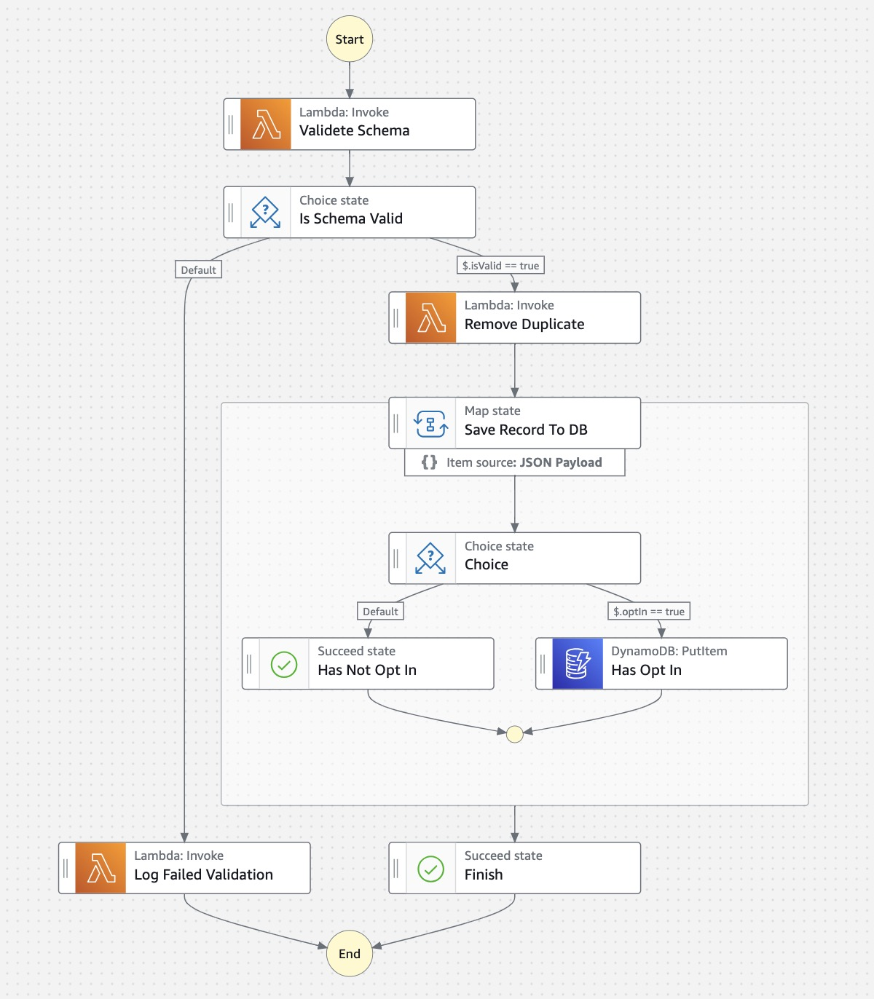

# CRM Data Processing Workflow

This project contains the source code and supporting files for a serverless application designed to process incoming CRM records. The workflow is built using AWS services and handles tasks such as schema validation, duplicate removal, and logging of marketing opt-ins to a DynamoDB table. The application utilizes the following AWS resources:

- **Lambda Functions** - Perform schema validation, remove duplicates, and save records to DynamoDB.
- **Step Functions** - Orchestrates the processing workflow.
- **DynamoDB** - Stores records for users who have opted in to receive marketing emails.
- **API Gateway** - Provides an interface to trigger the workflow.
- **CloudWatch Logs** - Logs records that fail schema validation for later processing.

## Architecture

The application is designed to implement the following processing workflow:

1. **Schema Validation**: Each incoming record is validated against a predefined schema. Records that do not match the schema are logged for future review.
    
    List of: (min 1)
    - name: string (required)
    - email: string (required)
    - optIn: boolean (required)
    - interests: list(string) (min 1)

2. **Duplicate Removal**: Duplicate records are identified and removed from the workflow.
3. **Marketing Opt-In Handling**: Records where the user has opted in to receive marketing emails are saved to a DynamoDB table, while others are ignored.

The application is built using the following AWS services:
- **Step Functions (State Machines)**: Coordinates the workflow.
- **API Gateway**: Provides an HTTP API to trigger the workflow.
- **Lambda**: Handles schema validation, duplicate removal, and database logging.
- **DynamoDB**: Stores marketing opt-in records.

## Project Structure

- **functions/** - Contains the Lambda functions' code.
  - `ValidateSchemaFunction` - Validates the incoming records against the schema.
  - `RemoveDuplicateFunction` - Removes duplicate records.
  - `LogSchemaErrorFunction` - Logs records that fail schema validation.
- **tasks** - Contains state machine workflow intrinsic tasks.
  - `DDBPutItemStep` - Saves marketing opt-in records to DynamoDB.
- **statemachines/** - Defines the state machine that orchestrates the workflow.
- **tests/** - Contains unit and integration tests for the Lambda functions.
- **template.yaml** - Defines the AWS resources for the application.

## Design

### High-Level Design

The high-level design of the CRM Data Processing Workflow is centered around the orchestration of tasks using AWS Step Functions, supported by Lambda functions, and integrated with DynamoDB for persistent storage.

<div style="text-align:center">
    <h4>Diagram 1: High-Level Architecture</h4>
    
</div>

### Detailed Workflow Design

The workflow follows a sequence of states managed by AWS Step Functions, each of which represents a specific task in the process.

<div style="text-align:center">
    <h4>Diagram 2: Flow Design</h4>
    
</div>

### Components Design

**Diagram 3: Component Template**

1. **API Gateway**: Acts as the entry point for incoming CRM records, triggering the workflow.
2. **Step Functions**: Orchestrates the workflow, ensuring records pass through schema validation, deduplication, and optionally saving to DynamoDB.
3. **Lambda Functions**:
   - **ValidateSchemaFunction**: Checks if incoming records match the expected schema.
   - **RemoveDuplicateFunction**: Filters out duplicate records.
   - **LogSchemaErrorFunction**: Logs records that fail schema validation to CloudWatch Logs.
   - **DDBPutItemFunction**: Saves records of users who have opted in to marketing to DynamoDB.
4. **DynamoDB**: Stores records of users who have opted in to receive marketing communications.

<div style="text-align:center">
    <h4>Diagram 4: CloudFormation Template Diagram</h4>
    
</div>

<div style="text-align:center">
    <h4>Diagram 4: State Machine Diagram</h4>
    
</div>

## Deployment

To deploy the application using the AWS SAM CLI, follow these steps:

### Prerequisites

Ensure you have the following installed:

- **SAM CLI** - [Install the SAM CLI](https://docs.aws.amazon.com/serverless-application-model/latest/developerguide/serverless-sam-cli-install.html)
- **Python 3** - [Install Python 3](https://www.python.org/downloads/)
- **Docker** - [Install Docker](https://hub.docker.com/search/?type=edition&offering=community)

### Build and Deploy

To build and deploy the application:

```bash
sam build --use-container
sam deploy --guided
```

If deploy throws s3 bucket error then:
```bash
sam build --use-container --s3-bucket <s3 bucket to deploy artifact>
sam deploy --guided
```

### SAM CLI Deployment Options

During the `sam deploy --guided` process, you will be prompted to provide:

- **Stack Name**: A unique name for your CloudFormation stack.
- **AWS Region**: The region where you want to deploy the application.
- **IAM Role Creation**: Permission to create IAM roles for the Lambda functions.
- **Save Configuration**: Option to save deployment configuration for future use.

## Local Development

To build and test the Lambda functions locally:

```bash
sam build --use-container
```

### Fetch and Tail Logs

Use `sam logs` to fetch logs from your deployed Lambda functions:

```bash
sam logs -n ValidateSchemaFunction --stack-name "crm" --tail
```

## Testing

Tests are provided in the `tests` directory:

- **Unit Tests**: Run using `pytest`:

```bash
pip install -r tests/requirements.txt --user
python -m pytest tests/unit -v
```

- **Integration Tests**: Deploy the stack first, then run:

```bash
AWS_SAM_STACK_NAME="crm" python -m pytest tests/integration -v
```

## Live Testing

The `APIEnpoint` is printed to the output when the application deploys:

```bash
curl -XPOST <APIEnpoint> -H 'Content-Type: application/json' -d '[{"name": "John Doe", "email": "john.doe@example.com", "optIn": true, "interests": ["datascience", "python"]}]'
```

## Cleanup

To delete the deployed application:

```bash
sam delete --stack-name "crm"
```

## Resources

For more information on SAM CLI and serverless applications:

- [AWS SAM Developer Guide](https://docs.aws.amazon.com/serverless-application-model/latest/developerguide/what-is-sam.html)
- [AWS Serverless Application Repository](https://aws.amazon.com/serverless/serverlessrepo/)